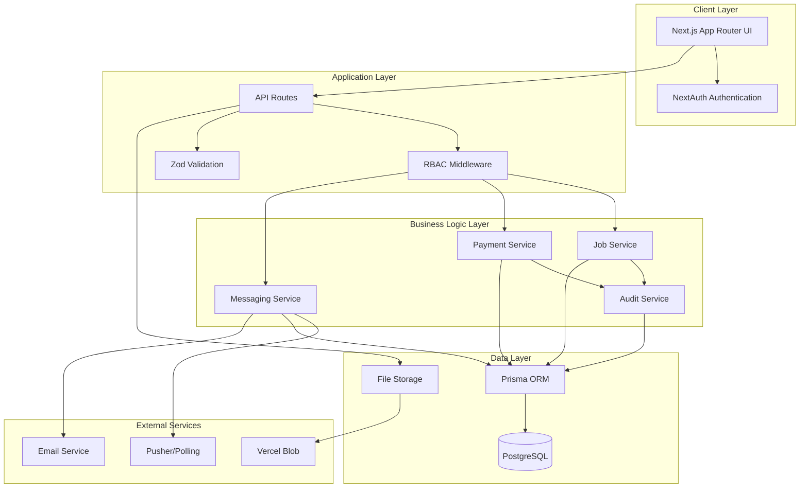

# Design Document

## Overview

The sports nurse matching platform is designed as a modern web application using Next.js App Router with TypeScript, providing a secure marketplace for connecting sports nurses with event organizers. The architecture follows a layered approach with clear separation of concerns, implementing escrow-based payment processing and comprehensive audit logging.

The system operates on a three-role model (admin/organizer/nurse) with role-based access control, ensuring appropriate feature access and data security. The MVP focuses on core matching functionality with mock payment processing, designed to be easily upgraded to real payment systems in future iterations.

## Architecture

### High-Level Architecture



### Technology Stack

- **Frontend**: Next.js 14+ App Router, TypeScript, TailwindCSS
- **Backend**: Next.js API Routes, Prisma ORM
- **Database**: PostgreSQL (Neon for production)
- **Authentication**: NextAuth.js with email/password and OAuth
- **Real-time**: Pusher or polling-based messaging
- **File Storage**: Vercel Blob Storage
- **Deployment**: Vercel
- **Testing**: Jest (unit), Playwright (E2E)
- **CI/CD**: GitHub Actions

## Components and Interfaces

### Core Domain Models

```typescript
// User and Authentication
interface User {
  id: string;
  email: string;
  role: 'admin' | 'organizer' | 'nurse';
  profile: UserProfile;
  createdAt: Date;
  updatedAt: Date;
}

interface UserProfile {
  name: string;
  phone?: string;
  city: string;
  prefecture: string;
  licenseNumber?: string; // nurses only
  skills: string[]; // nurses only
  ratingAverage?: number;
  ratingCount: number;
}

// Job Management
interface Job {
  id: string;
  organizerId: string;
  title: string;
  description: string;
  categories: string[];
  location: JobLocation;
  startAt: Date;
  endAt: Date;
  headcount: number;
  compensation: JobCompensation;
  deadline: Date;
  status: JobStatus;
  createdAt: Date;
  updatedAt: Date;
}

interface JobLocation {
  prefecture: string;
  city: string;
  venue: string;
  address?: string;
}

interface JobCompensation {
  type: 'hourly' | 'fixed';
  amount: number;
  currency: 'JPY';
}

type JobStatus = 
  | 'draft' 
  | 'open' 
  | 'applied' 
  | 'contracted' 
  | 'escrow_holding' 
  | 'in_progress' 
  | 'review_pending' 
  | 'ready_to_pay' 
  | 'paid' 
  | 'cancelled';

// Application and Communication
interface Application {
  id: string;
  jobId: string;
  nurseId: string;
  message: string;
  quote?: ApplicationQuote;
  status: ApplicationStatus;
  createdAt: Date;
  updatedAt: Date;
}

interface ApplicationQuote {
  breakdown: QuoteItem[];
  total: number;
  currency: 'JPY';
}

interface QuoteItem {
  description: string;
  amount: number;
}

// Messaging System
interface Thread {
  id: string;
  jobId: string;
  participants: string[];
  lastMessageAt: Date;
  createdAt: Date;
}

interface Message {
  id: string;
  threadId: string;
  senderId: string;
  content: string;
  attachments: MessageAttachment[];
  readBy: string[];
  createdAt: Date;
}

// Contract and Payment
interface JobOrder {
  id: string;
  jobId: string;
  templateType?: string;
  customDocumentUrl?: string;
  terms: ContractTerms;
  status: OrderStatus;
  createdAt: Date;
  acceptedAt?: Date;
}

interface EscrowTransaction {
  id: string;
  jobId: string;
  amount: number;
  platformFee: number;
  status: EscrowStatus;
  createdAt: Date;
  releasedAt?: Date;
}

// Reviews and Attendance
interface Review {
  id: string;
  jobId: string;
  authorId: string;
  targetId: string;
  rating: number;
  tags: string[];
  comment: string;
  createdAt: Date;
}

interface AttendanceRecord {
  id: string;
  jobId: string;
  nurseId: string;
  checkInAt?: Date;
  checkOutAt?: Date;
  notes?: string;
  irregularities?: string;
}
```

### Service Layer Interfaces

```typescript
interface JobService {
  createJob(data: CreateJobData): Promise<Job>;
  updateJob(id: string, data: UpdateJobData): Promise<Job>;
  searchJobs(filters: JobFilters): Promise<Job[]>;
  getJobById(id: string): Promise<Job | null>;
  applyToJob(jobId: string, application: ApplicationData): Promise<Application>;
}

interface PaymentService {
  createEscrow(jobId: string, amount: number): Promise<EscrowTransaction>;
  calculateFees(amount: number, paymentMethod: PaymentMethod): Promise<FeeCalculation>;
  processPayment(escrowId: string, method: PaymentMethod): Promise<PaymentResult>;
  releaseEscrow(escrowId: string): Promise<void>;
}

interface MessagingService {
  createThread(jobId: string, participants: string[]): Promise<Thread>;
  sendMessage(threadId: string, senderId: string, content: string): Promise<Message>;
  markAsRead(messageId: string, userId: string): Promise<void>;
  getThreads(userId: string): Promise<Thread[]>;
}

interface AuditService {
  logAction(action: AuditAction): Promise<void>;
  getAuditLogs(filters: AuditFilters): Promise<AuditLog[]>;
}
```

## Data Models

### Prisma Schema Structure

```prisma
model User {
  id        String   @id @default(uuid())
  email     String   @unique
  password  String?
  role      UserRole
  profile   Json
  createdAt DateTime @default(now())
  updatedAt DateTime @updatedAt
  
  // Relations
  organizedJobs    Job[]         @relation("OrganizerJobs")
  applications     Application[]
  sentMessages     Message[]
  reviews          Review[]      @relation("ReviewAuthor")
  receivedReviews  Review[]      @relation("ReviewTarget")
  attendanceRecords AttendanceRecord[]
  auditLogs        AuditLog[]
  
  @@map("users")
}

model Job {
  id           String        @id @default(uuid())
  organizerId  String
  title        String
  description  String
  categories   String[]
  location     Json
  startAt      DateTime
  endAt        DateTime
  headcount    Int
  compensation Json
  deadline     DateTime
  status       JobStatus     @default(DRAFT)
  createdAt    DateTime      @default(now())
  updatedAt    DateTime      @updatedAt
  
  // Relations
  organizer     User           @relation("OrganizerJobs", fields: [organizerId], references: [id])
  applications  Application[]
  threads       Thread[]
  orders        JobOrder[]
  escrow        EscrowTransaction?
  attendance    AttendanceRecord[]
  reviews       Review[]
  
  @@map("jobs")
}

model Application {
  id        String            @id @default(uuid())
  jobId     String
  nurseId   String
  message   String
  quote     Json?
  status    ApplicationStatus @default(PENDING)
  createdAt DateTime          @default(now())
  updatedAt DateTime          @updatedAt
  
  // Relations
  job   Job  @relation(fields: [jobId], references: [id])
  nurse User @relation(fields: [nurseId], references: [id])
  
  @@unique([jobId, nurseId])
  @@map("applications")
}

model Thread {
  id            String    @id @default(uuid())
  jobId         String
  participants  String[]
  lastMessageAt DateTime  @default(now())
  createdAt     DateTime  @default(now())
  
  // Relations
  job      Job       @relation(fields: [jobId], references: [id])
  messages Message[]
  
  @@map("threads")
}

model Message {
  id          String   @id @default(uuid())
  threadId    String
  senderId    String
  content     String
  attachments Json[]   @default([])
  readBy      String[] @default([])
  createdAt   DateTime @default(now())
  
  // Relations
  thread Thread @relation(fields: [threadId], references: [id])
  sender User   @relation(fields: [senderId], references: [id])
  
  @@map("messages")
}

model JobOrder {
  id                String      @id @default(uuid())
  jobId             String
  templateType      String?
  customDocumentUrl String?
  terms             Json
  status            OrderStatus @default(PENDING)
  createdAt         DateTime    @default(now())
  acceptedAt        DateTime?
  
  // Relations
  job Job @relation(fields: [jobId], references: [id])
  
  @@map("job_orders")
}

model EscrowTransaction {
  id          String       @id @default(uuid())
  jobId       String       @unique
  amount      Int
  platformFee Int
  status      EscrowStatus @default(AWAITING)
  createdAt   DateTime     @default(now())
  releasedAt  DateTime?
  
  // Relations
  job Job @relation(fields: [jobId], references: [id])
  
  @@map("escrow_transactions")
}

model AttendanceRecord {
  id            String    @id @default(uuid())
  jobId         String
  nurseId       String
  checkInAt     DateTime?
  checkOutAt    DateTime?
  notes         String?
  irregularities String?
  createdAt     DateTime  @default(now())
  
  // Relations
  job   Job  @relation(fields: [jobId], references: [id])
  nurse User @relation(fields: [nurseId], references: [id])
  
  @@unique([jobId, nurseId])
  @@map("attendance_records")
}

model Review {
  id        String   @id @default(uuid())
  jobId     String
  authorId  String
  targetId  String
  rating    Int
  tags      String[]
  comment   String
  createdAt DateTime @default(now())
  
  // Relations
  job    Job  @relation(fields: [jobId], references: [id])
  author User @relation("ReviewAuthor", fields: [authorId], references: [id])
  target User @relation("ReviewTarget", fields: [targetId], references: [id])
  
  @@unique([jobId, authorId, targetId])
  @@map("reviews")
}

model AuditLog {
  id       String   @id @default(uuid())
  actorId  String
  action   String
  target   String
  metadata Json
  createdAt DateTime @default(now())
  
  // Relations
  actor User @relation(fields: [actorId], references: [id])
  
  @@map("audit_logs")
}

// Enums
enum UserRole {
  ADMIN
  ORGANIZER
  NURSE
}

enum JobStatus {
  DRAFT
  OPEN
  APPLIED
  CONTRACTED
  ESCROW_HOLDING
  IN_PROGRESS
  REVIEW_PENDING
  READY_TO_PAY
  PAID
  CANCELLED
}

enum ApplicationStatus {
  PENDING
  ACCEPTED
  REJECTED
  WITHDRAWN
}

enum OrderStatus {
  PENDING
  ACCEPTED
  REJECTED
  CANCELLED
}

enum EscrowStatus {
  AWAITING
  HOLDING
  RELEASED
  REFUNDED
}
```

## Error Handling

### Error Classification

```typescript
enum ErrorType {
  VALIDATION = 'VALIDATION',
  AUTHORIZATION = 'AUTHORIZATION',
  NOT_FOUND = 'NOT_FOUND',
  BUSINESS_LOGIC = 'BUSINESS_LOGIC',
  EXTERNAL_SERVICE = 'EXTERNAL_SERVICE',
  SYSTEM = 'SYSTEM'
}

interface AppError {
  type: ErrorType;
  code: string;
  message: string;
  details?: Record<string, any>;
  statusCode: number;
}
```

### Error Handling Strategy

1. **Validation Errors**: Use Zod schemas for input validation with detailed field-level error messages
2. **Authorization Errors**: RBAC middleware returns appropriate 401/403 responses
3. **Business Logic Errors**: Custom error classes for domain-specific violations
4. **Database Errors**: Prisma error handling with user-friendly messages
5. **External Service Errors**: Graceful degradation with fallback mechanisms

### Global Error Handler

```typescript
export function globalErrorHandler(error: unknown): AppError {
  if (error instanceof ZodError) {
    return {
      type: ErrorType.VALIDATION,
      code: 'VALIDATION_FAILED',
      message: 'Input validation failed',
      details: error.flatten(),
      statusCode: 400
    };
  }
  
  if (error instanceof PrismaClientKnownRequestError) {
    return handlePrismaError(error);
  }
  
  // Handle other error types...
  
  return {
    type: ErrorType.SYSTEM,
    code: 'INTERNAL_ERROR',
    message: 'An unexpected error occurred',
    statusCode: 500
  };
}
```

## Testing Strategy

### Unit Testing (Jest)

**Coverage Areas:**
- Business logic functions (fee calculations, status transitions)
- Utility functions (date handling, validation)
- Service layer methods
- Custom hooks and components

**Key Test Categories:**
```typescript
describe('PaymentService', () => {
  describe('calculateFees', () => {
    it('should calculate correct fees for instant payment');
    it('should calculate correct fees for scheduled payment');
    it('should handle edge cases for minimum amounts');
  });
  
  describe('processEscrow', () => {
    it('should create escrow transaction with correct status');
    it('should update job status to escrow_holding');
    it('should create audit log entry');
  });
});

describe('JobStatusTransitions', () => {
  it('should allow valid status transitions');
  it('should reject invalid status transitions');
  it('should maintain audit trail for all transitions');
});
```

### Integration Testing (Playwright)

**End-to-End User Flows:**
1. **Complete Job Lifecycle**: Job creation → Application → Contract → Escrow → Completion → Payment
2. **Authentication Flows**: Registration, login, role-based access
3. **Communication Flows**: Messaging, file uploads, notifications
4. **Error Scenarios**: Invalid inputs, unauthorized access, system failures

**Test Structure:**
```typescript
test.describe('Job Lifecycle', () => {
  test('organizer can create job and nurse can apply', async ({ page }) => {
    // Test implementation
  });
  
  test('contract negotiation and acceptance flow', async ({ page }) => {
    // Test implementation
  });
  
  test('escrow and payment processing', async ({ page }) => {
    // Test implementation
  });
});
```

### Testing Infrastructure

- **Test Database**: Separate PostgreSQL instance for testing
- **Mock Services**: Mock payment processing and external APIs
- **Test Data**: Seed scripts for consistent test scenarios
- **CI Integration**: GitHub Actions running tests on PR and merge

## Security Considerations

### Data Protection

1. **PII Minimization**: Store only necessary personal information
2. **Data Encryption**: Encrypt sensitive fields at rest
3. **Access Control**: Role-based permissions with principle of least privilege
4. **Audit Logging**: Comprehensive logging of all sensitive operations

### Authentication & Authorization

```typescript
// RBAC Middleware
export function requireRole(roles: UserRole[]) {
  return async (req: NextRequest) => {
    const session = await getServerSession(authOptions);
    
    if (!session?.user) {
      return new Response('Unauthorized', { status: 401 });
    }
    
    if (!roles.includes(session.user.role)) {
      return new Response('Forbidden', { status: 403 });
    }
    
    return null; // Allow request to proceed
  };
}
```

### Input Validation

```typescript
// Zod schemas for all API inputs
export const createJobSchema = z.object({
  title: z.string().min(1).max(200),
  description: z.string().min(10).max(2000),
  startAt: z.date().min(new Date()),
  endAt: z.date(),
  compensation: z.object({
    type: z.enum(['hourly', 'fixed']),
    amount: z.number().min(0)
  })
}).refine(data => data.endAt > data.startAt, {
  message: "End time must be after start time"
});
```

### File Upload Security

1. **File Type Validation**: Whitelist allowed MIME types
2. **Size Limits**: Enforce maximum file sizes
3. **Virus Scanning**: Integrate with security scanning services
4. **Secure Storage**: Use signed URLs for file access

This design provides a solid foundation for the MVP while maintaining extensibility for future enhancements. The architecture supports the core user journeys while implementing necessary security and audit requirements.